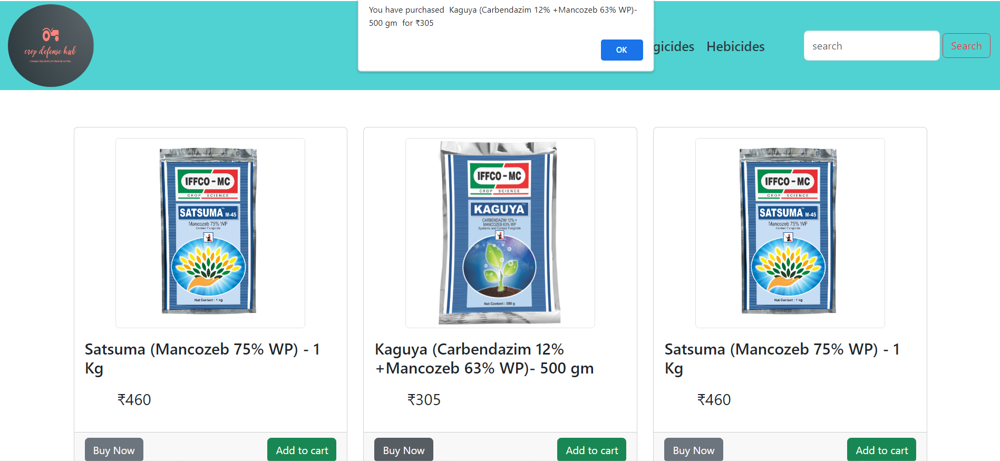

# Crop Defence
Crop Defense Hub is an e-commerce platform designed to help farmers and agricultural professionals purchase products related to crop protection and agriculture. This project is built using HTML, CSS, and JavaScript.

## Demo
https://crop-defense-hub.netlify.app/
## Screenshots

 
 

