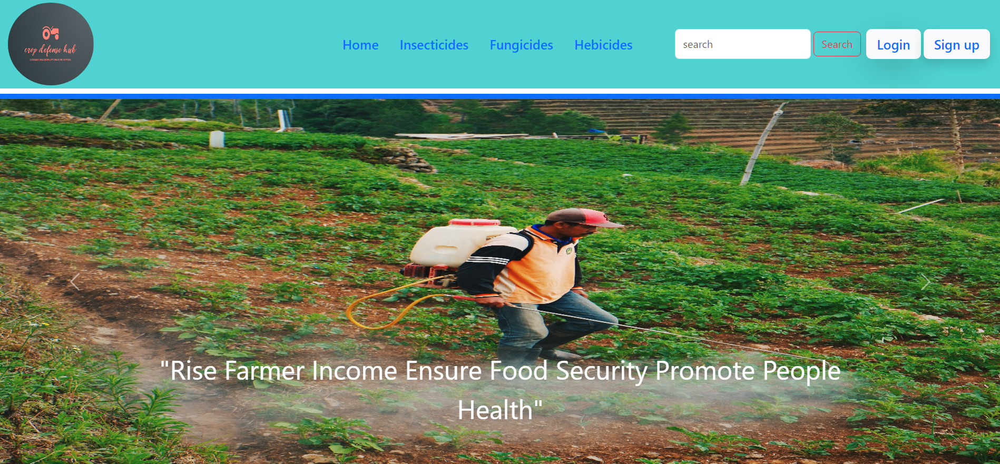
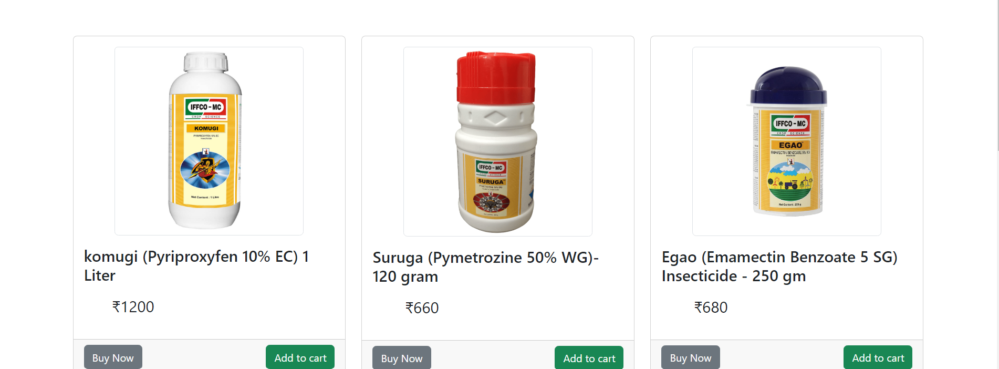
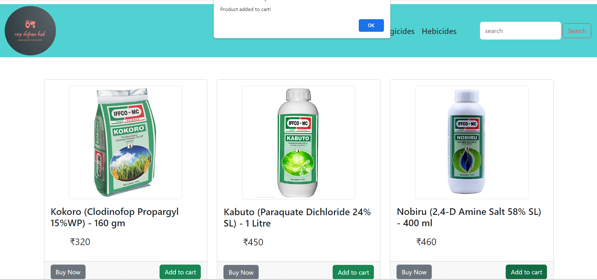

# Crop Defence
Crop Defense Hub is an e-commerce platform designed to help farmers and agricultural professionals purchase products related to crop protection and agriculture. This project is built using HTML, CSS, and JavaScript.

## Demo

You can see a live demo of Crop Defense Hub at 

## Screenshots

*Caption: This is the homepage of Crop Defense Hub.*

 
 !
[Alt text](ScreenShots/cd-4.png)
*Caption: A view of a product page with detailed information.*

